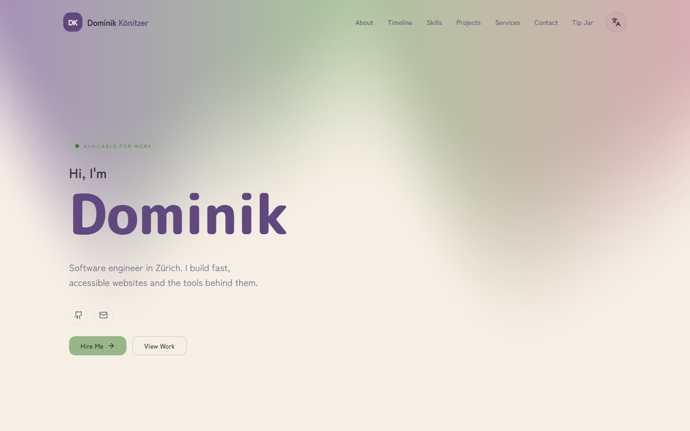

<div align="center">

# Dominik Könitzer, Portfolio

**A fast, multilingual, SEO-obsessed personal portfolio for a Swiss software engineer.**

[](https://github.com/dominikkoenitzer/Portfolio/actions/workflows/ci.yml)
[](./LICENSE)
[](https://dk.punds.ch)

[**Live → dk.punds.ch**](https://dk.punds.ch)



</div>

---

A single-page portfolio built with React, TypeScript, and Vite. It's a personal
site, but engineered like a product: four languages, structured data and AI-SEO
throughout, a WebGL background, page transitions, and a live GitHub-contributions
widget.

## Features

- **Fast SPA.** React 19 and Vite, manually code-split, with the WebGL background lazy-loaded off the critical path.
- **Four languages.** English, German, French, Chinese, on hand-rolled i18n with no library.
- **One palette, lifted from an illustration.** Dusty violet, sage and blush on a warm cream page, taken from the reference art rather than picked from a scale and kept deliberately muted, with a slow WebGL aurora (React Bits' Aurora) in the same three colours drifting across the top.
- **SEO and AI-SEO treated as real work.** JSON-LD (Person / FAQ / HowTo / Service), `llms.txt`, and per-page Open Graph cards.
- **Prerendered routes.** The build emits a real HTML document per route, twenty of them, each with its own title, description, canonical and OG image, so link unfurlers that don't run JavaScript still get the right preview.
- **Live GitHub contributions** widget, via a Vercel serverless function.
- **Accessible and responsive**, with reduced-motion-aware animation.

## Tech stack

| | |
| --- | --- |
| Framework | React 19 + TypeScript + Vite (SWC) |
| Styling | Tailwind CSS + shadcn/ui (Radix) |
| Animation | framer-motion + WebGL (`ogl`) |
| Data | `@tanstack/react-query` |
| Package manager | [bun](https://bun.sh) |
| Hosting | Vercel (deploys from `main`) |

## Quick start

Requires [bun](https://bun.sh).

```bash
bun install
bun run dev     # → http://localhost:1000
```

| Task | Command |
| --- | --- |
| Dev server (port **1000**) | `bun run dev` |
| Production build | `bun run build` |
| Preview the build | `bun run preview` |
| Typecheck | `bun run typecheck` |
| Lint | `bun run lint` |
| Unit tests | `bun run test` |
| Sitemap parity | `bun run check:sitemap` |
| JSON-LD validation | `bun run check:jsonld` |

> The GitHub-contributions widget reads a `GITHUB_TOKEN` from `.env.local`
> (server-side only, never bundled into the client). Without one it degrades
> gracefully. CI runs `typecheck`, `lint`, `test`, both SEO guards and `build`
> on every push and PR.

## Project structure

| Path | What |
| --- | --- |
| `src/pages/` | Route pages (default exports, lazy-loaded) |
| `src/components/` | UI components (named exports via barrels) |
| `src/components/seo/` | `<SEO>` component → meta tags + JSON-LD |
| `src/lib/translations/` | Hand-rolled i18n, one module per language |
| `src/constants/projects/` | Project data, one module per project |
| `src/config/seo-data/` | FAQ / HowTo content feeding the structured data |
| `public/` | Static assets, `og/` social cards, `llms.txt`, `sitemap.xml` |
| `api/` | Vercel serverless functions (contact form, GitHub contributions, keepalive) |

## Contributing

It's a personal project, but bug reports, accessibility issues, and suggestions
are welcome; see [CONTRIBUTING.md](./CONTRIBUTING.md). For security reports, see
[SECURITY.md](./SECURITY.md).

## License

**All rights reserved.** The code is published for reference and learning. It,
along with the personal content and branding, is **not** licensed for reuse or
redistribution. See [LICENSE](./LICENSE).

## Author

**Dominik Könitzer**, software engineer in Zürich, Switzerland.

[dk.punds.ch](https://dk.punds.ch) · [CV](https://dk.punds.ch/cv) · [@dominikkoenitzer](https://github.com/dominikkoenitzer) · [dominik.koenitzer@gmail.com](mailto:dominik.koenitzer@gmail.com)
